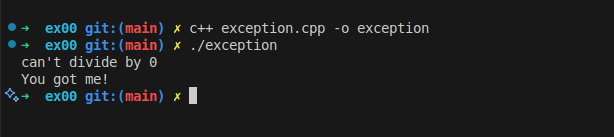
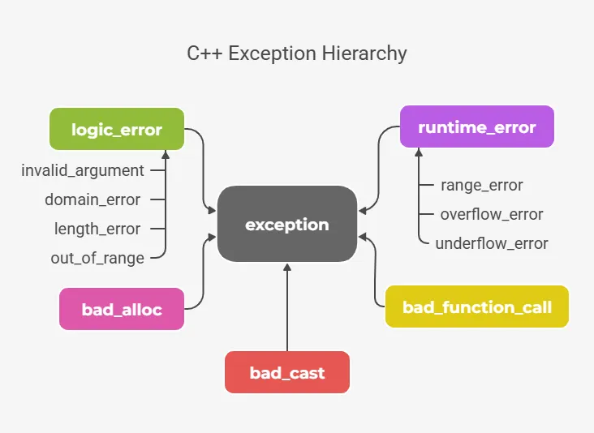

<h1 align="center">Repetition and Exceptions</h1>

## Introduction 

**Handle Exception** is a mechanism used to detect and manage errors that occur during the program execution, so its a **runtime** not compile time error.    

Normally when an error occur, the program terminates its execution. Using the exception handling we bypass the termination of the program by throwing exceptions and catch them for handling, allowing the program to continuing its execution.  

## Example of a program termination

```CPP
#include <iostream>

float divide(float f1, float f2)
{
	if (f2 == 0)
		throw 1337;
	return (f1 / f2);
}

int main()
{
	std::cout << divide(42, 0);
	std::cout << "You'll never see me!\n";
	return (0);
}
```

The output :
<p align=center>
	
</p>

In C++ when using `throw` and nobody `catch` it, the program calls `std::terminate` which crashes the program


## Handling with exception
```CPP
#include <iostream>

float divide(float f1, float f2)
{
	if (f2 == 0)
		throw 1337;
	return (f1 / f2);
}

int main()
{
	try
	{
		std::cout << divide(42, 0);
	}
	catch(int e)
	{
		std::cout << "can't divide by 0\n";
	}
	std::cout << "You got me!\n";
	return (0);
}
```

Output :  
<p align=center>
	
</p>

**Explanation :**     
The `divide(42, 0)` now is executed inside the `try` section, the `divide()` function throws an exception as integer equal `1337`, the `catch` block in main sees the integer coming from `divide()` function, then it execute the code inside the `catch` block and runs it, after that it comes the time for the recovery step where the program continue its execution considering the error is solved.  

## Syntax Explanation

### Try-catch Block

#### Catch one exception
```C++
try
{
	//Part could throw an Exception
}
catch(ExceptionType e)
{
	//handling the caught exception
}
```

Instead of implementing the part of the code that could throw an exception and terminate the program anywhere, we place this part inside the `try` block so we can handle the exception inside the `catch` block and recover the program from terminating to continuing the execution.   

#### Catch multiple exception
```cpp
try
{
	// part might throw an exception
}
catch(type1 e)
{
	// executed when exception of type1
}
catch(type2 e)
{
	// executed when exception of type2
}
catch(...)
{
	// the `catch(...)` syntax executed when no type of the aboves types is caught
}

```

### Throwing Exceptions

There are **three** types of values that could be thrown by exceptions :  
#### Throwing Built-in Types
Those are very simple types like the one we used on the example, it does not provide any useful information, this type is not much different from handling errors using if else statements, 
```cpp
if (f2 == 0)
	throw (1337);
```

#### Throwing Standard Exceptions
Those are set of classes derived from the class `std::exception` declared on the header `<stdexcept>`
<p align=center>
	
</p>

`what()` : A method present in every standard exception class to provide information about the exception itself.  

#### Throwing Custom Exceptions
Sometimes the standard exceptions cannot satisfy our requirement, so we need to create a new class and we inherit `std::exception`.   

