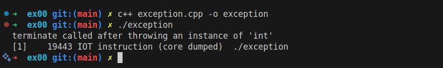

<h1 align="center">Repetition and Exceptions</h1>

### Introduction 

It is a mechanism used to detect and manage errors that occur during the program execution, so its a **runtime** not compile time error.    

Normally when an error occur, the program terminate its execution. Using the exception handling we bypass the termination of the program by throwing exceptions and catch them for handling, allowing the program to continuing its execution.  

### Example of a program termination

```CPP
#include <iostream>

float divide(float f1, float f2)
{
	if (f2 == 0)
		throw 1337;
	return (f1 / f2);
}

int main()
{
	std::cout << divide(42, 0);
	std::cout << "You'll never see me!\n";
	return (0);
}
```

The output :
<p align=center>
	
</p>
In C++ when using `throw` and nobody `catch` it, the program calls `std::terminate` which crashes the program


### Handling with exception
```CPP
#include <iostream>

float divide(float f1, float f2)
{
	if (f2 == 0)
		throw 1337;
	return (f1 / f2);
}

int main()
{
	try
	{
		std::cout << divide(42, 0);
	}
	catch(int e)
	{
		std::cout << "can't divide by 0\n";
	}
	std::cout << "You got me!\n";
	return (0);
}
```

Output :  
<p align=center>
	
</p>

Explanation :   
The `divide(42, 0)` now is executed inside the `try` section, the `divide()` function throws a signal with an integer equal `1337`, the `catch` block in main sees the integer coming from `divide()` function, then it execute the code inside the `catch` block and runs it, after that it comes the time for the recovery step where the program continue its execution considering the error is solved.  

