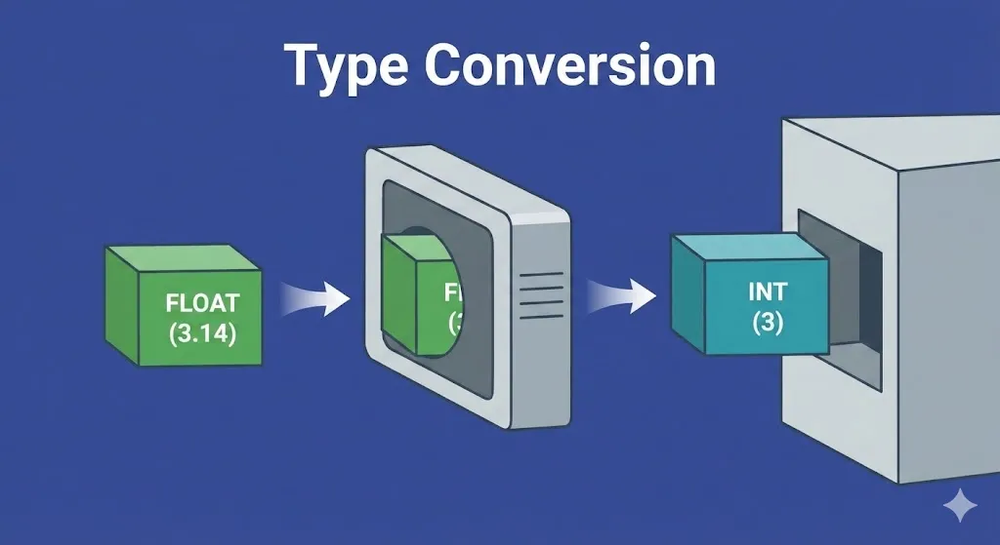
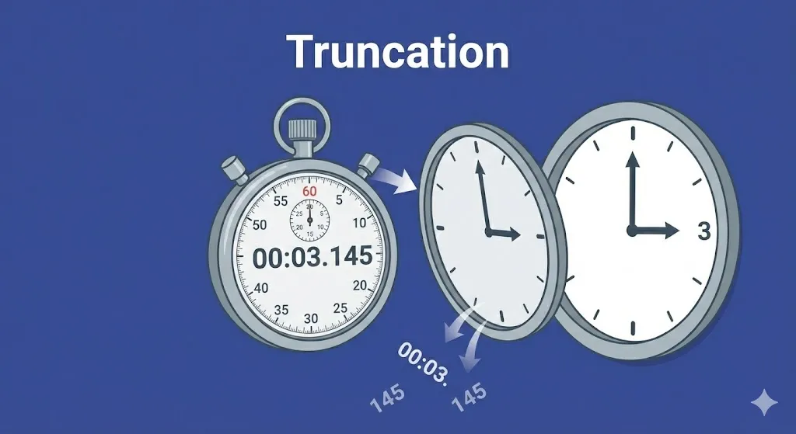
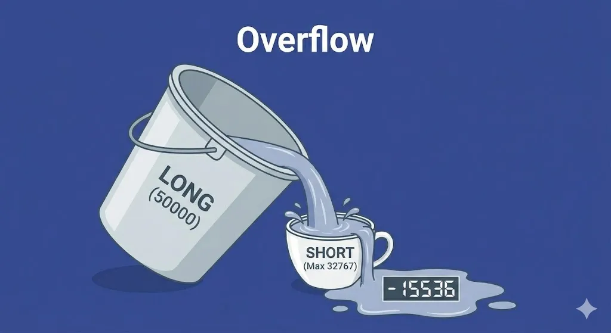
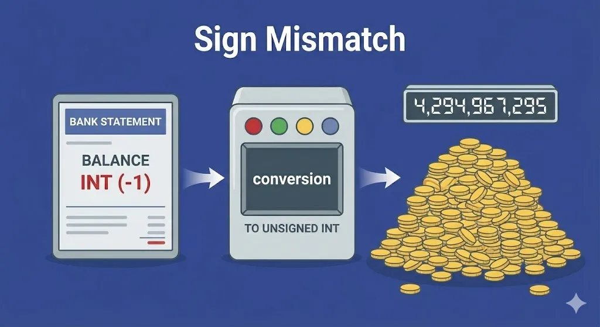
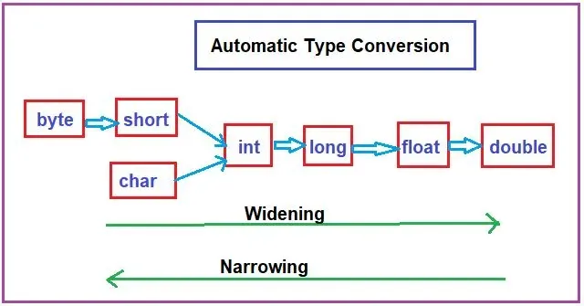
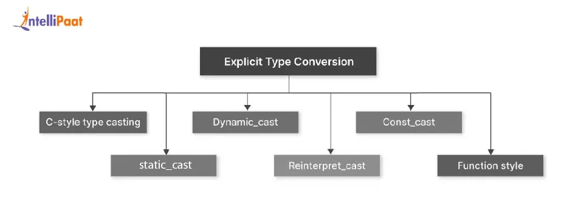

<h1 align=center> Casting Operators</h1>

# Type Conversion

## Definition 
**Type Conversion** means converting one data type to another compatible data type, the only rule is it shouldn't lose its meaning. we need it for managing different data types.  

<p align=center>
	
</p>


## Information Losing
 Data has its own value and format, when converting a data to a new type that can't hold its value or format we talking here about losing its meaning;    

### Truncation 
Losing the precision of number, for example converting a **float** number to **int** we gonna lose its precision, for example `3.145 (float)` gonna converted to `3 (int)` so we lost the `.145` and its gone forever! 
<p align=center>
	
</p>

### Overflow 
This happens when converting a huge number into a small cup, for example converting `long 50000` into `short` variable, we know that the maximum value that a short can handle is `32767`, so converting our value gonna overflow and just gives us `(short ) -15536` ;   
    <p align=center>
	
</p>

### Sign Mismatch
Happens when mixing negative numbers in types that can only be positive, for example converting `(int) -1` into a `unsigned int` type gonna just gives us the maximum value of the unsigned integer, so the conversion gonna equal around `4 billion` instead of `-1`;  
        <p align=center>
	
</p>


# Types of Type Conversion

## Implicit Type  
The implicit type is when the compiler **automatically** convert the data types bases on needed cases, for example :  
+ Operations are performed of values with the different data types;  
+ Passing argument type X to a function that expect a data type Y;  
+ Assigning a value of one data type to variable of another type;  
<p align=center>
	
</p>

+ **Widening :** Also known as promotion, converting a value from a smaller or less precise data type to a large or more precise data type.  
+ **Narrowing :** Demotion, the opposite process. It is highly possible  to lead to **meaning lost** that we talk about earlier.   

## Explicit Type
The explicit type conversion also called **type casting** is the conversion of one type of data type to another type **manually** by the programmer.  it can be done by two ways :  
+ **C Style Typecasting :** This method is inherited from C. `(newType) expression;` also known as forceful casting;  
+ **C++ Style Typecasting :** This method is an unary operator which force one data type to be converted into another data type. Also called **casting operators**! C++ support four types of typecasting, there is **static, dynamic, reinterpret and const cast** ;  
<p align=center>
	
</p>

### Static Cast
Static cast type is a compile time check! If the conversion is impossible or nonsense, the compiler breaks with an error and refuse to build the executable file.  
There is no run-time safety because every checks happens on the compile time.  

**Syntax**  
```c++
static_cast<newType> (source);
```

It is like the C-style casting, but the static_cast is stricter and safer, on the C-style cast the compiler tries to apply each possible C++ casts until one works, in a specific order :  
+ `const_cast`;  
+ `static_cast`;  
+ `static_cast` followed by `const_cast`;  
+ ...etc

The `static_cast` is safer and stricter because it remove the ability to do dangerous stuff like turning integer into pointer (reinterpret_cast) or removing the constness (const_cast).  

**Example**  
```cpp
#include <iostream>

class Base {};
class Derived : public Base {};

int main()
{
	float a = 10,513;
	int   x = static_cast<int>(a);
	std::cout << "a is " << a << " and x is " << x << std::endl; // gonna print 10
	

	Derived der;
	Base* ba = static_cast<Base*>(&der);
	
	
	return(0);	
}
```

**Another Example**  
static_cast operator allows casting from any pointer type to void pointer and vice versa.  
```c++
#include <iostream>

int main()
{
	int x = 1337;
	void* vo = static_cast<void*> (&x);
	void* ip = static_cast<int*> (vo);
	
	std::cout << *vo << std::endl; // gonna print 1337
}
```

# Exercises 
## ex00  
### Is class a namespace ??
while using the syntax `ScalarConverter::convert(av[1])`, we gonna notice that it is equivalent to the **namespace** syntax `std::cout`. Here where some student think of a class as a namespace. is it ?  

+ **Namespaces :** are purely for grouping code to prevent **naming collisions**, we cannot create an instance of a namespace;  
+ **Classes :** are blueprints for objects, the syntax that looks like the namespace is valid only for the **static** methods, because they don't need an object to be called, so we can call them using `ScalarConverter::convert(av[1])`.   

